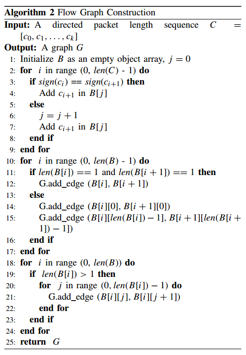

> [Toward Early and Accurate Network Intrusion Detection Using Graph Embedding | IEEE Journals & Magazine | IEEE Xplore](https://ieeexplore.ieee.org/document/10262084/references)

`first`文件夹是算法最早的版本

使用数据集`1592993485_noise.pcap`

## 使用flowcontainer提取ip packets length

调用已有库进行提取即可

由`features_extraction.py`实现

## 图构建



使用python复现了上述代码，由于需要适配后面的graph2vec算法的数据结构，对上述算法的逻辑进行了一定的改进。

分析g2v的数据结构：

```json
{
    "edges": 
    [[11, 10], [11, 13], [11, 7], [10, 12], [10, 5], [13, 14], [12, 15], [15, 14], [14, 9], [17, 19], [17, 8], [16, 8], [16, 6], [16, 18], [19, 20], [19, 4], [1, 7], [0, 7], [3, 9], [2, 9], [5, 6]], 
    "features": 
    {"0": "1", "1": "1", "2": "1", "3": "1", "4": "1", "5": "2", "6": "2", "7": "2", "8": "2", "9": "2", "10": "3", "11": "3", "12": "3", "13": "3", "14": "3", "15": "3", "16": "3", "17": "3", "18": "3", "19": "3", "20": "3"}
}
```

边是由节点编号组成，特征表示节点的值，据此作出如下改动:

* 预处理时进行编码，然后将符号表示在编码上，然后构建边

* 将节点特征直接表示在features特性中

最终导出json文件

由`graph_construction.py`实现

## graph2vec


